# Automated Asset-Agnostic Trading Intelligence System — Project Specification

**Document status:** Product/technical project model  
**Primary objective:** maximize risk-adjusted, benchmark-aware, net-of-cost portfolio growth across market regimes.  
**Core constraint:** the system must prove value through validation before capital is exposed. Prediction quality is insufficient unless portfolio, risk, execution, and opportunity-cost metrics improve after fees and slippage.

## Priority Legend

| Priority | Meaning | Release obligation |
|---|---|---|
| P0 | Required for MVP or any capital exposure | Must be implemented and tested before live trading. |
| P1 | Required for robust beta | Must be designed in MVP and implemented before scaling. |
| P2 | Expansion / optimization | Implement after a stable live/paper evidence base exists. |

## External Reference Anchors

The control framework uses official regulatory and risk-management references as design inputs, not as legal advice. ESMA MiFID II Article 17 emphasizes algorithmic trading systems, thresholds, limits, monitoring, testing, and records. eCFR 17 CFR Part 38 covers automated trade surveillance and real-time market monitoring for designated contract markets. SEC Regulation SCI provides useful systems-integrity concepts for trading, market data, routing, regulation, and surveillance systems. NIST AI RMF is used as a lifecycle risk-management reference for AI systems. FIA electronic trading materials provide industry control themes for pre-trade risk management, post-trade analysis, exchange testing, and volatility controls. See `09_references.md`.

---

# 1. Product Vision and Objectives

## 1.1 Product vision

Build a modular trading intelligence platform that continuously ingests normalized market data across assets and venues, generates calibrated probabilistic market-state estimates, converts those estimates into constrained trade/no-trade and portfolio allocation decisions, and validates every strategy through historical replay, synthetic stress, paper trading, and monitored production gates.

The product is not a promise of market prediction. It is a decision system that explicitly models uncertainty, transaction costs, liquidity, drawdown risk, exposure concentration, capital preservation, and benchmark-relative performance.

## 1.2 Product goals

| ID | Priority | Goal | Measurable success criterion |
|---|---:|---|---|
| PG-001 | P0 | Preserve and grow portfolio value on a risk-adjusted basis. | Net Sharpe, Sortino, Calmar, and max drawdown beat configured benchmark and cash baseline in walk-forward and paper trading. |
| PG-002 | P0 | Treat no-trade as a first-class decision. | ≥ 95% of generated signals include explicit expected net edge, uncertainty, cost estimate, and no-trade alternative. |
| PG-003 | P0 | Prevent unsafe automation. | All orders pass pre-trade checks for limits, liquidity, slippage, position, daily loss, and kill-switch state. |
| PG-004 | P0 | Support asset-agnostic research and execution. | Same pipeline can ingest at least 3 asset classes or venue types through a common instrument schema. |
| PG-005 | P0 | Provide reproducible evaluation. | Any model/strategy decision can be replayed from immutable data snapshot, feature version, model version, config, and code commit. |
| PG-006 | P1 | Adapt to market regimes without unvalidated online self-modification. | Regime classifier and drift monitors trigger review/retraining, but model promotion remains gated. |
| PG-007 | P1 | Quantify opportunity cost. | Evaluation reports compare strategy equity curve against cash, asset buy-and-hold, equal-weight basket, volatility-targeted baseline, and configured market benchmark. |
| PG-008 | P2 | Automate strategy portfolio selection. | Meta-policy selects among validated strategies under exposure/risk-budget constraints and improves net risk-adjusted score in out-of-sample tests. |

## 1.3 Product principles

1. **Capital preservation precedes trade frequency.** A flat position can be the best decision when expected edge is below cost/risk thresholds.
2. **Validation beats complexity.** No architecture component is justified unless it improves measurable evaluation or risk control.
3. **Every decision is auditable.** The system must explain what it knew, what it predicted, which constraints applied, and why an order was or was not sent.
4. **Live learning is quarantined.** Continuous data and evaluation are allowed in production; automatic weight updates that affect live capital are not allowed without promotion gates.
5. **Net performance is the product.** All metrics include fees, spread, slippage, borrow/funding where applicable, failed fills, latency, and tax/custody placeholders where relevant.

---

# 2. Scope, Assumptions, and Explicit Non-Goals

## 2.1 In scope

| Area | Priority | Scope |
|---|---:|---|
| Data ingestion | P0 | Historical and streaming OHLCTV, trades, bid/ask, order book snapshots/deltas, fees, venue status, instrument metadata. |
| Feature engineering | P0 | Technical indicators, returns, volatility, liquidity, microstructure, regime, benchmark-relative, and cross-asset context. |
| Modeling | P0 | Offline-trained transformer or sequence model producing calibrated probabilistic forecasts and uncertainty. |
| Strategy layer | P0 | Trade/no-trade, position sizing, allocation, risk gating, and execution-intent generation. |
| Simulation | P0 | Historical replay, paper trading, fake assets, costs, slippage, partial fills, latency, and stress scenarios. |
| Evaluation | P0 | Model, strategy, portfolio, and trading-engine metrics with promotion gates. |
| Risk controls | P0 | Pre-trade checks, max drawdown, exposure limits, liquidity limits, order throttles, kill switch, and audit trail. |
| Multi-venue support | P1 | Exchange/broker adapter abstraction with normalized capabilities and venue-specific constraints. |
| RL/meta-policy | P1 | Offline/simulated policy tuning for sizing, allocation, trade selection, and strategy selection. |
| Live trading | P1 | Small-capital controlled live mode after paper-trading gates. |
| Advanced data | P2 | Sentiment, news, fundamentals, options surfaces, on-chain data, macro calendars, and alternative data. |

## 2.2 Assumptions

| ID | Assumption | Validation method |
|---|---|---|
| A-001 | Initial users are internal researchers/operators, not retail customers. | Confirm target user and jurisdiction before production. |
| A-002 | Data access is legal, licensed, and technically available for selected venues. | Legal/data-vendor review; ingestion acceptance test. |
| A-003 | MVP supports spot crypto and liquid equities first; derivatives are deferred unless explicitly approved. | Asset coverage decision record. |
| A-004 | Technical-analysis features may contain useful signals, but no alpha is assumed. | Walk-forward tests and paper trading must prove incremental value. |
| A-005 | Live deployment starts with capped notional and human-supervised controls. | Production checklist and risk sign-off. |
| A-006 | The system has no market-making obligation in MVP. | Exclude strategies that require continuous two-sided quoting. |

## 2.3 Explicit non-goals

| ID | Priority | Non-goal | Reason |
|---|---:|---|---|
| NG-001 | P0 | Guarantee profit or predictive accuracy. | Markets are stochastic and non-stationary. |
| NG-002 | P0 | Optimize raw returns without risk/cost adjustment. | Conflicts with primary objective. |
| NG-003 | P0 | Fully autonomous live self-training and deployment. | Unsafe without promotion gates. |
| NG-004 | P0 | High-frequency latency arbitrage. | Requires different infrastructure, colocation, market access, and controls. |
| NG-005 | P0 | Circumvent exchange rules, market abuse rules, rate limits, or account restrictions. | Legal and operational risk. |
| NG-006 | P1 | Retail investment advice or client-facing recommendations. | Requires separate compliance, suitability, and disclosures. |
| NG-007 | P1 | Tax optimization engine. | Tax-lot accounting is tracked as data, but optimization is deferred. |
| NG-008 | P1 | Custody/settlement platform. | Integrate with custodians/brokers/exchanges; do not build custody. |
| NG-009 | P2 | Full fundamental/macro/news intelligence in MVP. | Scope control; can be added as exogenous features later. |

## 2.4 Critical missing items added to the goal set

| Missing item | Priority | Why it is critical | Testable requirement |
|---|---:|---|---|
| Data rights and license register | P0 | Invalid data use can invalidate productization. | Every source has license, retention, redistribution, and production-use status. |
| Transaction cost analysis | P0 | Sim results are unreliable without execution-quality measurement. | Fill prices compared to arrival, mid, VWAP/TWAP, and simulated slippage. |
| Custody/exchange solvency risk | P0 for crypto | Exchange failure can dominate strategy PnL. | Per-venue capital caps and withdrawal/liquidity procedures exist. |
| Benchmark governance | P0 | “Outperformance” is meaningless without defined baselines. | Every evaluation declares benchmark, risk-free/cash proxy, and rebalance assumptions. |
| Model governance | P0 | Prevents silent model drift and unsafe deployment. | Model registry, approvals, rollback, and monitoring are mandatory. |
| Incident response | P0 | Automated trading can fail quickly. | Kill switch, rollback, incident severity levels, and postmortem templates exist. |

---

# 3. Functional Requirements

## 3.1 Product-level functional requirements

| ID | Priority | Requirement | Acceptance criteria |
|---|---:|---|---|
| FR-001 | P0 | Ingest historical OHLCTV bars for configurable instruments and timeframes. | Backfill ≥ 2 years for MVP instruments or all available history; missing bars flagged; schema validated. |
| FR-002 | P0 | Ingest real-time trades, quotes, and order book data where venue supports it. | Stream latency, completeness, and sequence gaps measured per venue; reconnect and gap-fill tested. |
| FR-003 | P0 | Normalize instruments across venues. | Same canonical asset can map to exchange symbols, quote currencies, tick size, lot size, min notional, fees, and session calendar. |
| FR-004 | P0 | Calculate technical indicators without lookahead. | Indicator timestamp uses only data available at or before decision time; unit tests include shifted leakage checks. |
| FR-005 | P0 | Create training datasets by event time. | Train/validation/test splits preserve chronology and prevent cross-asset leakage through future aggregates. |
| FR-006 | P0 | Train at least one baseline model and one transformer/sequence model. | Baselines and sequence model evaluated on identical walk-forward windows with statistical comparison. |
| FR-007 | P0 | Produce probabilistic outputs, not only point predictions. | Output includes expected return distribution or quantiles, confidence/uncertainty, and calibrated class probabilities. |
| FR-008 | P0 | Convert model outputs into trade/no-trade decisions. | Decision object includes action, instrument, horizon, expected net edge, risk, cost, size proposal, and rejection reason if no-trade. |
| FR-009 | P0 | Enforce pre-trade risk controls. | Orders blocked if they violate max notional, max position, max daily loss, liquidity, spread, volatility, venue status, or kill-switch state. |
| FR-010 | P0 | Run historical replay with realistic cost model. | Backtest includes fees, spread, slippage, partial fills, latency, market order/limit order behavior, and failed fills. |
| FR-011 | P0 | Run paper trading using live market data. | Paper account tracks orders, fills, slippage estimates, portfolio PnL, drawdown, exposure, and rejected signals. |
| FR-012 | P0 | Continuously evaluate model, strategy, portfolio, and engine health. | Dashboard and alerts report current metrics, thresholds, breaches, and owner. |
| FR-013 | P0 | Store immutable decision logs. | Every signal/order/fill has trace ID, data snapshot ID, feature version, model version, config version, and timestamp. |
| FR-014 | P0 | Support manual kill switch. | Operator can block new orders and cancel open orders within one command/API action; state persisted and audited. |
| FR-015 | P0 | Support automated kill switch. | Triggered on configured daily loss, drawdown, data anomaly, model drift, venue incident, order error burst, or latency breach. |
| FR-016 | P1 | Support multiple venues through adapters. | At least two venue adapters pass identical capability tests and normalized order lifecycle tests. |
| FR-017 | P1 | Support strategy library and strategy portfolio. | Strategies can be enabled/disabled, versioned, scored, constrained, and compared. |
| FR-018 | P1 | Support offline RL or contextual bandit policy tuning. | RL policy improves validation reward versus fixed heuristics without breaching risk constraints. |
| FR-019 | P1 | Support capital allocation across assets. | Portfolio allocator respects cash, venue, asset, sector/category, volatility, correlation, and concentration limits. |
| FR-020 | P1 | Support model update workflow. | Candidate model requires offline metrics, simulation, paper trading, approval, staged rollout, and rollback plan. |
| FR-021 | P2 | Incorporate exogenous data. | Feature families can be added without schema breaks and must show incremental validation value. |
| FR-022 | P2 | Support derivatives/funding/borrow-aware assets. | Funding, margin, liquidation, borrow, contract multiplier, and expiry are modeled before derivatives go live. |

## 3.2 Technical functional requirements

| ID | Priority | Requirement | Acceptance criteria |
|---|---:|---|---|
| TFR-001 | P0 | Provide data source connectors. | Connector interface supports backfill, stream, heartbeat, rate-limit handling, retry, and provenance metadata. |
| TFR-002 | P0 | Maintain bronze/silver/gold data layers. | Raw data is immutable; cleaned data has quality flags; feature data has lineage to raw source. |
| TFR-003 | P0 | Version feature computation. | Feature set has semantic version and hash of code/config; incompatible changes create new version. |
| TFR-004 | P0 | Provide reproducible experiment runner. | Given run ID, system resolves data snapshot, code commit, config, model weights, and metrics. |
| TFR-005 | P0 | Provide model registry. | Registry stores candidate/champion status, metrics, approvals, artifacts, rollback pointer, and expiry/review date. |
| TFR-006 | P0 | Provide strategy registry. | Strategy versions store parameters, risk profile, eligible instruments, owner, and deployment state. |
| TFR-007 | P0 | Provide execution gateway abstraction. | Gateway supports place, amend, cancel, order status, balances, venue metadata, and idempotency keys. |
| TFR-008 | P0 | Provide simulator matching execution interface. | Same strategy code can run in simulation, paper, and live with dependency injection. |
| TFR-009 | P0 | Provide alerting. | Breaches notify configured channel with severity, metric, current value, threshold, and runbook link. |
| TFR-010 | P1 | Provide portfolio optimizer. | Produces target weights subject to constraints and validates against risk budget before order generation. |
| TFR-011 | P1 | Provide model serving. | Inference service meets configured SLA and returns versioned, schema-validated predictions. |
| TFR-012 | P1 | Provide offline policy training environment. | Environment replays market states and order-book conditions with deterministic seed control. |

---

# 4. Non-Functional Requirements

| ID | Priority | Category | Requirement | Acceptance criteria |
|---|---:|---|---|---|
| NFR-001 | P0 | Correctness | No lookahead leakage. | Automated leakage tests fail build if future columns influence features/labels. |
| NFR-002 | P0 | Reliability | Data ingestion recovers from disconnects. | Simulated disconnect test results in reconnect and gap reconciliation without duplicate bars/trades. |
| NFR-003 | P0 | Availability | MVP research stack availability. | ≥ 99% during scheduled research hours; downtime logged. |
| NFR-004 | P0 | Security | API keys and secrets are protected. | No secrets in code/logs; secrets manager; least-privilege keys; withdrawal disabled where possible. |
| NFR-005 | P0 | Auditability | Full decision trace. | Random sample of 100 decisions can be reconstructed end-to-end. |
| NFR-006 | P0 | Reproducibility | Experiment determinism. | Re-running same experiment returns same metrics within defined floating-point tolerance. |
| NFR-007 | P0 | Performance | Backtest throughput. | MVP can replay one year of 1-minute data for 100 instruments in configured compute budget. |
| NFR-008 | P0 | Latency | Decision latency budget. | Live decision pipeline records p50/p95/p99 latency; orders blocked if stale beyond strategy horizon threshold. |
| NFR-009 | P0 | Data quality | Missing and stale data detection. | Alerts fire when completeness, freshness, duplicate rate, or timestamp drift breaches threshold. |
| NFR-010 | P0 | Safety | Kill-switch durability. | Kill-switch state survives service restart and blocks order placement until explicitly cleared. |
| NFR-011 | P1 | Scalability | Venue and asset onboarding. | New venue adapter requires no changes to model/strategy core beyond mapping/config. |
| NFR-012 | P1 | Maintainability | Modular code boundaries. | Data, feature, model, strategy, risk, execution, and evaluation packages have explicit interfaces and contract tests. |
| NFR-013 | P1 | Cost | Cost observability. | Training, storage, inference, and data-vendor cost reported per experiment and per production day. |
| NFR-014 | P1 | Privacy/compliance | Record retention. | Retention policy configured by jurisdiction/source; deletion/archival procedure tested. |
| NFR-015 | P2 | Portability | Cloud/on-prem option. | Infrastructure-as-code can deploy research and paper stack to a second environment. |

---

# 5. Core Use Cases

| ID | Use case | Actor | Priority | Precondition | Success outcome |
|---|---|---|---:|---|---|
| UC-001 | Backfill market history | Data engineer | P0 | Venue credentials and instrument list exist. | Normalized, quality-scored historical dataset available. |
| UC-002 | Build training dataset | ML engineer | P0 | Clean bars/trades/books exist. | Chronological train/validation/test datasets with features and labels. |
| UC-003 | Train candidate model | ML engineer | P0 | Dataset and baseline config exist. | Candidate model registered with metrics and calibration report. |
| UC-004 | Run historical replay | Quant researcher | P0 | Candidate model/strategy exists. | Net-of-cost performance report with benchmark comparison. |
| UC-005 | Run synthetic stress test | Risk owner | P0 | Strategy has configuration. | Strategy response to shocks, gaps, liquidity loss, and exchange outage documented. |
| UC-006 | Start paper trading | Operator | P0 | Candidate passed simulation gates. | Paper orders/fills tracked and evaluated live without capital exposure. |
| UC-007 | Review promotion gate | Product/risk committee | P0 | Paper metrics meet minimum duration/sample. | Approve, reject, or extend paper validation with rationale. |
| UC-008 | Execute live small-capital trade | Operator/system | P1 | Live gate approved and kill switch clear. | Order accepted only after all pre-trade checks pass. |
| UC-009 | Trigger automated halt | Risk engine | P0 | Breach occurs. | New orders blocked, open orders optionally cancelled, alert emitted, incident logged. |
| UC-010 | Diagnose drift | ML/risk engineer | P1 | Drift alert fired. | Root-cause report links data, feature, model, strategy, and market-regime evidence. |
| UC-011 | Compare strategies | Portfolio manager | P1 | Multiple validated strategies exist. | Allocation proposal ranks strategies by risk-adjusted net contribution. |
| UC-012 | Reproduce decision | Auditor/operator | P0 | Trace ID exists. | Reconstructed decision matches original inputs, outputs, checks, and order intent. |

---

# 6. User Stories with Acceptance Criteria

| ID | Priority | Story | Acceptance criteria |
|---|---:|---|---|
| US-001 | P0 | As a quant researcher, I want to run a walk-forward backtest so that I can estimate out-of-sample strategy performance. | Given a model and strategy config, when I run walk-forward evaluation, then the report includes per-window net return, Sharpe, Sortino, max drawdown, turnover, exposure, cost, and benchmark-relative metrics. |
| US-002 | P0 | As an ML lead, I want candidate models compared against simple baselines so that complexity is justified. | Candidate cannot be promoted unless it beats naive momentum/mean-reversion, buy-and-hold, cash, and previous champion by configured criteria or has documented risk-control value. |
| US-003 | P0 | As a risk owner, I want pre-trade checks so that unsafe orders are blocked before reaching a venue. | Orders above configured notional, position, liquidity, spread, volatility, stale-data, or loss thresholds are rejected with a machine-readable reason. |
| US-004 | P0 | As an operator, I want a kill switch so that I can immediately stop trading. | Activating kill switch blocks new orders and records operator, timestamp, reason, affected strategies, and cancel-open-orders choice. |
| US-005 | P0 | As a data engineer, I want every dataset to carry quality metrics so that models do not train on corrupted data. | Dataset build fails if missing rate, duplicate rate, timestamp drift, or schema violations exceed thresholds. |
| US-006 | P0 | As a portfolio owner, I want no-trade decisions logged so that inactivity can be evaluated. | Signal log includes rejected and no-trade decisions with expected edge, cost threshold, uncertainty, and alternative baseline performance. |
| US-007 | P0 | As an auditor, I want reproducible decisions so that live outcomes are explainable. | Given a trace ID, replay reconstructs data snapshot, features, model output, risk checks, decision, and order/fill events. |
| US-008 | P1 | As a PM, I want staged rollout so that live risk grows only after evidence accumulates. | Live capital cap increases only when paper/live gates pass for configured duration, number of trades, and drawdown constraints. |
| US-009 | P1 | As an ML engineer, I want drift monitoring so that degraded models are identified before they lose capital. | Feature, prediction, residual, calibration, and portfolio-performance drift metrics trigger alerts and disable promotion when thresholds breach. |
| US-010 | P1 | As a strategy owner, I want RL-tuned sizing tested offline so that sizing improves without unsafe exploration. | Offline policy must beat fixed-size and volatility-targeted heuristics in simulation without increasing CVaR or max drawdown beyond limit. |
| US-011 | P1 | As an execution engineer, I want transaction cost analysis so that simulations match live reality. | Post-trade report compares execution price to arrival mid, quote, VWAP/TWAP, predicted slippage, realized slippage, and fill probability. |
| US-012 | P2 | As a researcher, I want to add alternative data so that exogenous signals can be tested. | New data source must pass licensing, schema, latency, quality, leakage, and incremental-value tests before use in models. |

---

# 7. System Architecture

## 7.1 Architecture principles

| Principle | Implementation implication |
|---|---|
| Separate research from execution | Research jobs cannot send live orders; execution keys unavailable in research environment. |
| Same strategy code across modes | Simulation, backtest, paper, and live implement the same execution gateway interface. |
| Event-time correctness | All data is processed by event time; ingestion time is separately tracked. |
| Immutable raw data | Raw vendor/exchange payloads are never overwritten. |
| Promotion gates | Models/strategies move through candidate → simulation-approved → paper-approved → limited-live → scaled-live. |
| Risk engine is independent | Risk controls cannot be bypassed by model or strategy code. |

## 7.2 Logical architecture

```mermaid
flowchart LR
  A[Market Data Sources: exchanges, brokers, vendors] --> B[Connectors: backfill, stream, heartbeat]
  B --> C[Raw Event Log / Bronze]
  C --> D[Normalizer + Instrument Master]
  D --> E[Clean Market Store / Silver]
  E --> F[Feature Engine + TA + Order Book + Regime]
  F --> G[Feature Store / Gold]
  G --> H[Dataset Builder]
  H --> I[Offline Training: baselines + transformer]
  I --> J[Model Registry]
  J --> K[Inference Service]
  G --> K
  K --> L[Strategy/Agent Layer]
  L --> M[Risk Engine: limits, liquidity, kill switch]
  M --> N{Mode}
  N --> O[Historical Replay Simulator]
  N --> P[Paper Trading Gateway]
  N --> Q[Live Execution Gateway]
  Q --> R[Exchange/Broker Adapters]
  O --> S[Evaluation + Reports]
  P --> S
  Q --> S
  S --> T[Monitoring, Alerts, Audit, Drift]
  T --> J
```

## 7.3 Component responsibilities

| Component | Priority | Responsibilities | Must not do |
|---|---:|---|---|
| Instrument Master | P0 | Canonical assets, venue symbols, calendars, tick/lot/min notional, quote/base mapping, fee tiers. | Guess symbol mappings without approval. |
| Data Connectors | P0 | Backfill, stream, retries, heartbeats, raw payload preservation, rate-limit handling. | Apply business logic or labels. |
| Normalizer | P0 | Convert payloads into canonical schemas; sequence checks; data quality flags. | Drop bad data silently. |
| Feature Engine | P0 | Compute TA, microstructure, regime, benchmark-relative features. | Use future data or mutable live-only state in offline datasets. |
| Dataset Builder | P0 | Build chronological splits, labels, sample weights, metadata. | Randomly shuffle time-series across future/past boundaries. |
| Model Trainer | P0 | Train baselines and transformer candidates; calibration; uncertainty. | Auto-promote to production. |
| Model Registry | P0 | Version artifacts, metrics, approvals, lineage, champion/candidate state. | Store untraceable models. |
| Inference Service | P1 | Serve predictions with version, latency, schema validation, fallback. | Place orders directly. |
| Strategy/Agent Layer | P0 | Convert predictions into trade/no-trade, target positions, and order intents. | Override risk engine. |
| Risk Engine | P0 | Enforce pre-trade, portfolio, venue, capital, drawdown, liquidity, drift, and kill-switch controls. | Depend on model optimism. |
| Execution Gateway | P0 | Normalize place/amend/cancel/status/balance APIs and idempotent order lifecycle. | Accept non-risk-approved orders. |
| Simulator | P0 | Replay historical/live-paper market states and model fills/costs/latency. | Reuse future market state for current fills. |
| Evaluation Service | P0 | Compute metrics, reports, dashboards, promotion gates. | Report gross PnL as primary score. |
| Observability/Audit | P0 | Logs, traces, lineage, alerts, incidents, reproducibility. | Allow unlogged manual overrides. |

## 7.4 Deployment environments

| Environment | Purpose | Capital exposure | Promotion requirement |
|---|---|---:|---|
| Offline research | Backtests, feature analysis, model training. | None | Data quality and leakage tests. |
| Historical simulation | Replay past data with execution model. | None | Walk-forward and stress gates. |
| Synthetic simulation | Fake/stressed assets and market scenarios. | None | Scenario survival and risk behavior. |
| Paper trading | Live data, simulated orders/fills/accounting. | None | Duration, trade-count, and drawdown gates. |
| Limited live | Real orders with capped capital. | Small capped notional | Manual approval, daily review, rollback. |
| Scaled live | Larger capital under portfolio risk budget. | Controlled | Ongoing monitoring and periodic re-approval. |

---

# 8. Data Acquisition Plan

## 8.1 Required data domains

| Domain | Priority | Examples | Minimum data contract |
|---|---:|---|---|
| OHLCTV bars | P0 | Open, high, low, close, volume, trade count, quote volume, VWAP where available. | instrument_id, venue_id, timeframe, open_time, close_time, OHLC, volume fields, source_ts, quality flags. |
| Trades | P0 | Price, size, side/aggressor if available, trade ID. | instrument_id, venue_id, event_ts, price, quantity, side, trade_id, raw_payload_id. |
| Quotes | P0 | Best bid/ask, bid/ask size. | event_ts, bid, ask, bid_size, ask_size, sequence, source_ts. |
| Order book | P1 | L2/L3 snapshots and deltas. | book_id, sequence, side, price_level, size, update_type, snapshot flag. |
| Instrument metadata | P0 | Symbol, base, quote, tick, lot, min order, status, trading hours. | effective_from/to; versioned changes. |
| Fees | P0 | Maker/taker, tier, rebates, funding/borrow if applicable. | account_id/tier, venue, instrument, side, order_type, effective time. |
| Slippage/TCA | P0 | Arrival mid, spread, realized fill, simulated fill. | order_id, decision_ts, arrival_quote, fill events, predicted/realized slippage. |
| Balances/positions | P0 | Cash, asset balances, margin, reserved funds. | account_id, venue_id, asset_id, free, locked, equity, timestamp. |
| Venue status | P0 | Maintenance, trading halt, degraded API. | venue_id, status, affected instruments, start/end, source. |
| Benchmarks | P0 | Cash, BTC/ETH, SPY/market index, equal-weight basket. | benchmark_id, return series, rebalance rule, source. |
| Corporate actions | P1 for equities | Splits, dividends, delistings, symbol changes. | action_type, effective date, adjustment factor, source. |
| Macro/funding | P2 | Rates, funding, borrow, calendars. | timestamp, region, source, revision timestamp. |

## 8.2 Source selection criteria

| Criterion | Priority | Requirement |
|---|---:|---|
| Legal right to use | P0 | Every source must have documented license, rate limits, retention, production-use, and redistribution status. |
| Event-time fidelity | P0 | Source must provide timestamps precise enough for intended strategy horizon. |
| Completeness | P0 | Historical coverage must cover validation windows and stress periods. |
| Survivorship-bias control | P0 for equities | Delisted assets and corporate actions included when testing universe strategies. |
| Cost transparency | P1 | Data cost per instrument/timeframe tracked. |
| Redundancy | P1 | Critical live feeds should have backup or fallback source. |

## 8.3 Acquisition phases

| Phase | Priority | Deliverables |
|---|---:|---|
| DA-0: Source/legal review | P0 | Approved source register; license matrix; security review. |
| DA-1: Historical backfill | P0 | Bars, trades, metadata, fees for MVP instruments. |
| DA-2: Streaming MVP | P0 | Live bars/trades/quotes with heartbeat and gap reconciliation. |
| DA-3: Order book | P1 | L2 snapshot/delta ingestion and book reconstruction tests. |
| DA-4: Multi-venue | P1 | At least two exchange/broker adapters. |
| DA-5: Exogenous data | P2 | Alternative data ingestion after leakage and value tests. |

---

# 9. Historical and Continual Data Processing Plan

## 9.1 Data layers

| Layer | Purpose | Mutability | Acceptance criteria |
|---|---|---|---|
| Bronze/raw | Preserve exact source payload. | Immutable append-only. | Raw payload hash and source metadata stored. |
| Silver/normalized | Canonical schema, deduped, validated, quality flags. | Append/replace only by versioned correction jobs. | Every record links to raw payload/source. |
| Gold/features | Feature-ready time-aligned data. | Versioned immutable snapshots. | Feature set version and code hash recorded. |
| Dataset snapshot | Training/evaluation inputs. | Immutable. | Dataset hash, split rules, label rules, and source versions recorded. |

## 9.2 Historical processing requirements

| ID | Priority | Requirement | Acceptance criteria |
|---|---:|---|---|
| HP-001 | P0 | Process by event time, not ingestion time. | All joins use event-time windows and declare data availability lag. |
| HP-002 | P0 | Detect missing intervals. | Gap report by instrument/timeframe; gaps above threshold block training. |
| HP-003 | P0 | Deduplicate trades/bars. | Duplicate rate reported; deterministic dedupe rule documented. |
| HP-004 | P0 | Adjust equities for corporate actions. | Backtest can run adjusted and raw views; adjustment lineage stored. |
| HP-005 | P0 | Prevent label leakage. | Labels start after decision timestamp plus configured execution delay. |
| HP-006 | P0 | Preserve delisted/inactive instruments in historical universe tests. | Universe builder uses point-in-time membership. |
| HP-007 | P0 | Align timeframes. | Higher timeframe features lagged until bar close plus availability delay. |
| HP-008 | P0 | Store fees by effective date. | Cost model uses fee schedule valid at decision time. |

## 9.3 Continual processing requirements

| ID | Priority | Requirement | Acceptance criteria |
|---|---:|---|---|
| CP-001 | P0 | Stream health checks. | Freshness, sequence gaps, heartbeat, duplicate rate, and outlier checks emitted per stream. |
| CP-002 | P0 | Late event handling. | Late data updates quality status and triggers derived-feature repair job when applicable. |
| CP-003 | P0 | Drift checks. | Data, feature, prediction, residual, strategy, and portfolio drift are computed on rolling windows. |
| CP-004 | P0 | Fail closed on critical data issues. | Risk engine blocks orders when required feeds are stale or degraded. |
| CP-005 | P1 | Champion/challenger evaluation. | Candidate models score live data in shadow mode without affecting orders. |
| CP-006 | P1 | Incremental features. | Streaming feature computation matches batch features within tolerance. |

## 9.4 Anti-drift mechanisms

| Drift type | Metric examples | Trigger | Automated action | Human action |
|---|---|---|---|---|
| Data completeness | Missing bars, gap count, stale seconds. | Threshold breach. | Block affected instruments. | Source incident review. |
| Feature distribution | PSI, KS statistic, z-score shifts. | Sustained window breach. | Downgrade model confidence or force no-trade. | Drift triage. |
| Prediction drift | Entropy, probability distribution shift, uncertainty spike. | Distribution outside training envelope. | Reduce position cap. | Model review. |
| Calibration drift | Brier/NLL, reliability curve slope. | Calibration worse than threshold. | Disable model promotion; reduce live cap. | Recalibration/retrain. |
| Strategy drift | Hit rate, edge decay, turnover spike, slippage spike. | Below control limits. | Disable strategy if severe. | Strategy review. |
| Portfolio drift | Drawdown, VaR/CVaR, beta, concentration. | Risk-budget breach. | Halt or de-risk. | Risk committee review. |
| Execution drift | Fill rate, reject rate, latency, slippage error. | TCA breach. | Switch order type/venue or halt. | Execution model recalibration. |

---

# 10. Feature Engineering Plan

## 10.1 Feature design principles

| Principle | Rule |
|---|---|
| Point-in-time correctness | Feature value must be computable at decision timestamp. |
| Net-edge focus | Features should help estimate expected return, uncertainty, liquidity, cost, or risk. |
| Cross-asset comparability | Normalize price-dependent features by volatility, ATR, spread, or price. |
| Regime awareness | Same signal can have different value in trend, mean-reversion, panic, and illiquid regimes. |
| Robustness | Winsorize or rank-normalize features when extreme values are likely data errors or regime shocks. |
| Ablation | Feature families must prove incremental contribution versus baselines. |

## 10.2 TA indicator features

| Feature family | Priority | Examples | Validation |
|---|---:|---|---|
| Returns/momentum | P0 | log returns, multi-horizon returns, rolling z-score, breakout distance, relative strength. | Incremental IC and strategy contribution after costs. |
| Moving averages | P0 | SMA/EMA/WMA slopes, price-vs-MA, MA cross distance. | Test horizons and lag sensitivity. |
| Volatility | P0 | realized vol, ATR, Parkinson/Garman-Klass where valid, Bollinger width. | Forecast/calibration value for sizing and stops. |
| Oscillators | P0 | RSI, stochastic, Williams %R, CCI. | Regime-conditioned value, not global assumption. |
| Trend strength | P0 | ADX, directional movement, Hurst proxy, slope t-stat. | Value in trend-regime classifier and strategy gating. |
| Volume/flow | P0 | OBV, volume z-score, volume-price trend, VWAP distance, accumulation/distribution. | Compare with and without volume features. |
| Support/resistance | P1 | rolling highs/lows, pivot levels, drawdown from high, distance to VWAP bands. | Backtest impact on entry/exit and stops. |
| Multi-timeframe | P1 | 1m/5m/1h/1d aligned features. | Lagged until higher timeframe close; leakage tests. |
| Cross-sectional | P1 | rank momentum, relative vol, relative liquidity, beta to benchmark. | Universe-based walk-forward tests. |

## 10.3 Order book and microstructure features

| Feature | Priority | Definition | Use |
|---|---:|---|---|
| Spread | P0/P1 | best ask - best bid; bps spread. | Cost threshold, liquidity gating. |
| Top-of-book depth | P1 | bid/ask size at best levels. | Fill probability, impact model. |
| Order book imbalance | P1 | normalized bid vs ask depth over top N levels. | Short-horizon signal and execution timing. |
| Depth slope | P1 | cumulative depth by price distance. | Slippage estimation. |
| Microprice | P1 | size-weighted top-of-book price. | Short-horizon fair-value proxy. |
| Trade imbalance | P1 | buyer/seller-initiated volume imbalance. | Momentum/exhaustion detection. |
| Book update rate | P1 | updates per second/minute. | Regime, venue stress, adverse selection. |
| Cancel/add ratio | P2 | cancellations vs new depth. | Toxic flow and instability proxy. |
| Queue position proxy | P2 | expected fill priority based on posted size and updates. | Limit-order execution model. |
| Cross-venue spread | P2 | price difference net of fees/transfer constraints. | Venue routing, not latency arbitrage in MVP. |

## 10.4 Market regime context

| Regime dimension | Priority | Features | Decision impact |
|---|---:|---|---|
| Trend vs range | P0 | ADX, slope, breakout persistence, Hurst proxy. | Select trend-following vs mean-reversion strategies. |
| Volatility state | P0 | realized vol percentile, ATR percentile, volatility-of-volatility. | Position scaling, stop width, no-trade gates. |
| Liquidity state | P0 | spread percentile, depth percentile, volume z-score. | Trade size cap, order type, venue selection. |
| Market drawdown | P0 | benchmark drawdown, asset drawdown, correlation spike. | De-risking and capital preservation scoring. |
| Correlation regime | P1 | rolling correlations, PCA/eigenvalue concentration. | Portfolio diversification and concentration risk. |
| Session/calendar | P1 | time of day, exchange session, weekend/holiday, earnings/macro placeholder. | Avoid low-liquidity or known event windows. |
| Stablecoin/fiat stress | P1 for crypto | peg deviation, venue premium, withdrawal status. | Quote asset risk and venue exposure caps. |
| Funding/borrow | P2 | funding rates, borrow rates, margin pressure. | Derivatives and shorting constraints. |

## 10.5 Labeling plan

| Label | Priority | Purpose | Notes |
|---|---:|---|---|
| Forward return distribution | P0 | Predict probabilistic return over horizon. | Use net of estimated costs for decision layer. |
| Direction class | P0 | Up/down/flat classification. | Flat/no-edge class is mandatory. |
| Barrier outcome | P0 | Profit target vs stop-loss vs timeout. | Useful for trade/no-trade and exit learning. |
| Max adverse excursion | P0 | Drawdown risk after entry. | Supports sizing and stop logic. |
| Liquidity/cost label | P1 | Expected slippage/fill probability. | Trained from historical order book and paper/live fills. |
| Regime label | P1 | State detection. | Can be unsupervised but must be validated through strategy utility. |

---

# 11. Model Strategy

## 11.1 Modeling stance

The model is a probabilistic market-state estimator. It should not directly decide capital exposure without a strategy and risk layer. A useful model may improve decisions through better uncertainty, no-trade selection, drawdown avoidance, cost prediction, or regime classification even if directional accuracy is modest.

## 11.2 Baselines before transformers

| Baseline | Priority | Purpose | Promotion implication |
|---|---:|---|---|
| Cash/no-trade | P0 | Measures capital preservation. | Any strategy must justify risk versus cash. |
| Buy-and-hold benchmark | P0 | Measures opportunity cost. | Outperformance is benchmark-relative. |
| Equal-weight/vol-target basket | P0 | Tests simple diversification. | Active model must beat simple allocation. |
| Simple TA heuristics | P0 | Tests if ML adds value. | Transformer must beat moving-average/RSI/volatility baselines. |
| Logistic/GBM/linear models | P0 | Tests if deep sequence model is necessary. | Transformer complexity only justified by net validation gain. |

## 11.3 Transformer design

| Design element | Priority | Specification |
|---|---:|---|
| Input unit | P0 | Asset-time token containing normalized OHLCV, TA, liquidity, regime, benchmark-relative, and metadata embeddings. |
| Multi-resolution context | P1 | Encode short/medium/long timeframes via hierarchical attention or separate encoders merged before output head. |
| Asset embeddings | P0 | Asset/venue/category embeddings allowed, but model must generalize to unseen or held-out assets through shared normalized features. |
| Masking | P0 | Attention mask prevents access to future bars, future aggregate features, and future benchmark returns. |
| Outputs | P0 | Return quantiles/distribution, direction probabilities including flat, uncertainty, expected drawdown, liquidity/cost estimate, and optional regime probabilities. |
| Calibration | P0 | Temperature/isotonic/calibration layer or quantile calibration evaluated on validation and paper windows. |
| Robustness | P1 | Dropout/ensembles/conformal intervals or uncertainty estimation used to reduce position size under uncertainty. |
| Interpretability | P1 | Store feature attribution/attention diagnostics as debug signals, not as proof of causality. |

## 11.4 Discrete vs continual training decision

| Mode | Allowed for MVP? | Reason | Controls |
|---|---:|---|---|
| Offline batch training | Yes, P0 | Reproducible and auditable. | Fixed datasets, model registry, approval gates. |
| Scheduled retraining | Yes, P1 | Captures new regimes with controlled cadence. | Weekly/monthly candidate training; no automatic promotion. |
| Drift-triggered candidate retraining | Yes, P1 | Responds to regime/data drift. | Candidate goes to shadow/paper first. |
| Online fine-tuning in shadow | P2 | Research only until proven safe. | No live capital effect; capped compute; rollback. |
| Online self-updating live model | No | Unsafe and hard to audit. | Explicitly prohibited unless future governance redesign approves. |

**Decision:** Use discrete, versioned training for production. Continual data ingestion, continual evaluation, and shadow candidates are allowed. Live model updates require model registry promotion, backtest, simulation, paper-trading evidence, and approval.

## 11.5 Alignment strategy

| Alignment target | Implementation requirement |
|---|---|
| Risk-adjusted growth | Optimize validation objective using log returns, volatility penalty, drawdown penalty, CVaR penalty, turnover/cost penalty, and benchmark-relative term. |
| Trade/no-trade discipline | Reward abstention when expected net edge does not exceed uncertainty and cost threshold. |
| Capital protection | Penalize drawdown depth, drawdown duration, tail loss, liquidity exposure, and correlated risk. |
| Cost awareness | Include fees, spread, slippage, funding/borrow, and failed fills in reward and evaluation. |
| Robustness | Require performance across regimes; reject models that only work in one historical period without regime-specific deployment rules. |
| Human governance | Candidate models must produce model cards and risk cards before promotion. |

## 11.6 Model-update lifecycle

| Stage | Entry criteria | Exit criteria |
|---|---|---|
| Candidate | New code/config/data snapshot created. | Training completes; data/leakage tests pass. |
| Offline validated | Metrics beat thresholds across walk-forward windows. | Calibration, ablation, and stress reports pass. |
| Shadow live | Runs on live data without decisions. | Prediction quality and drift stable for configured duration. |
| Paper trading | Strategy uses candidate outputs in paper account. | Meets paper gates: net risk-adjusted score, drawdown, slippage error, trade count. |
| Limited live | Approved by owner; capital cap set. | Live metrics stable; no severe incidents. |
| Champion | Candidate replaces prior champion. | Rollback pointer and monitoring thresholds set. |
| Deprecated | Drift, underperformance, incident, or replacement. | Disabled from new orders; retained for audit. |

---

# 12. Agent and Strategy Layer

## 12.1 Decision pipeline

| Step | Input | Output | Required checks |
|---|---|---|---|
| State assembly | Latest features, positions, balances, venue status. | Market/portfolio state vector. | Freshness, completeness, clock sync. |
| Model inference | State vector. | Probabilistic forecasts and uncertainty. | Schema, model version, latency, calibration status. |
| Opportunity scoring | Forecasts, costs, liquidity, benchmark. | Expected net edge per candidate action. | Edge must exceed cost + uncertainty margin. |
| Strategy selection | Candidate actions and regime. | Strategy action: buy/sell/hold/rebalance/no-trade. | Strategy eligibility by asset/regime. |
| Position sizing | Action, volatility, risk budget, drawdown state. | Target size/weight. | Max notional, VaR/CVaR, volatility target, liquidity cap. |
| Order planning | Target position, current position, order book. | Order intents. | Order type, time-in-force, price bands, partial-fill plan. |
| Risk approval | Order intents. | Approved/rejected orders. | Pre-trade and portfolio constraints. |
| Execution | Approved orders. | Venue order IDs/fills/rejections. | Idempotency, throttles, retry policy. |
| Post-trade evaluation | Fills, quotes, state. | TCA and portfolio update. | Slippage, reject rate, exposure, PnL. |

## 12.2 Decision object schema

| Field | Required | Description |
|---|---:|---|
| trace_id | Yes | Unique ID linking data, prediction, decision, order, and evaluation. |
| decision_ts | Yes | Event-time decision timestamp. |
| instrument_id | Yes | Canonical instrument. |
| venue_id | Yes | Intended venue or `none` for no-trade. |
| horizon | Yes | Prediction/holding horizon. |
| action | Yes | buy, sell, reduce, rebalance, hold, no-trade. |
| model_version | Yes | Model registry ID. |
| strategy_version | Yes | Strategy registry ID. |
| expected_return | Yes | Expected gross return. |
| expected_cost | Yes | Fees + spread + slippage + funding/borrow if applicable. |
| expected_net_edge | Yes | Expected return minus expected cost and risk margin. |
| uncertainty | Yes | Quantile width, confidence, entropy, or conformal interval. |
| risk_score | Yes | Drawdown/liquidity/volatility/correlation score. |
| proposed_size | Yes | Proposed quantity/notional/weight. |
| approved_size | Yes | Risk-adjusted size after constraints. |
| rejection_reason | Yes if rejected/no-trade | Machine-readable reason. |
| benchmark_context | Yes | Expected benchmark/cash alternative. |

## 12.3 Strategy archetypes

| Strategy | Priority | Description | Go-live condition |
|---|---:|---|---|
| No-trade/cash preservation | P0 | Stay flat or reduce exposure when edge is weak or risk is high. | Always available. |
| Volatility-targeted trend following | P0 | Enter with trend/regime confirmation; scale by volatility and drawdown. | Beats moving-average baseline after costs. |
| Mean reversion | P1 | Trades oversold/overbought conditions in range regimes. | Regime classifier validated; strict stop/timeout. |
| Breakout with liquidity filter | P1 | Trades breakouts only when volume/depth supports execution. | Slippage model validated. |
| Cross-sectional rotation | P1 | Allocates among assets by relative strength/risk. | Survivorship-bias-safe universe data. |
| Portfolio de-risking overlay | P0 | Reduces positions under drawdown, volatility, correlation, or model-drift stress. | Required before live. |
| Meta-strategy selector | P2 | Selects strategy weights by regime and recent validated performance. | Requires multiple proven strategies. |

## 12.4 Trade/no-trade criteria

A candidate trade is rejected unless all P0 conditions hold:

| Criterion | P0 threshold rule |
|---|---|
| Expected edge | Expected net edge > configured minimum edge + uncertainty buffer. |
| Cost coverage | Expected gross edge > fees + spread + slippage + funding/borrow + safety margin. |
| Liquidity | Order size ≤ configured percentage of rolling volume/depth at intended participation rate. |
| Spread | Current spread ≤ strategy-specific max spread percentile or bps limit. |
| Volatility | Current volatility within strategy envelope; otherwise size reduced or no-trade. |
| Drawdown | Portfolio drawdown below hard limit; soft drawdown reduces size. |
| Correlation | New position does not breach concentration/correlation cap. |
| Data freshness | Required feeds not stale; no unresolved sequence gaps. |
| Venue status | Venue and instrument status normal; no maintenance/halt. |
| Kill switch | Global, venue, strategy, and instrument kill switches are clear. |

---

# 13. RL Plan for Policies, Allocation, Trade Sizing, and Strategy Selection

## 13.1 RL scope

RL is not used for unbounded live exploration. It is used offline and in simulation to tune policy choices that are hard to optimize with supervised learning alone: trade sizing, allocation, strategy selection, exit timing, and order-type selection.

## 13.2 RL problem formulation

| Element | Specification |
|---|---|
| State | Features, model forecasts, uncertainty, order book, positions, cash, current risk budget, drawdown, regime, venue status. |
| Action | no-trade, enter/exit/reduce, target weight, order type, limit offset, strategy weight. |
| Reward | Net log portfolio return - cost penalty - drawdown penalty - CVaR penalty - volatility penalty - turnover penalty + benchmark-relative term. |
| Constraints | Hard limits on leverage, notional, per-asset exposure, drawdown, liquidity participation, order frequency, and venue concentration. |
| Environment | Historical replay and synthetic simulator with stochastic fills, slippage, latency, fees, partial fills, and market-impact approximations. |
| Evaluation | Off-policy validation, walk-forward, paper trading, stress survival, and comparison to deterministic heuristics. |

## 13.3 RL approach by phase

| Phase | Priority | Approach | Acceptance criteria |
|---|---:|---|---|
| RL-0 | P0 | No RL in live MVP; use deterministic risk sizing. | MVP trades can operate safely without RL. |
| RL-1 | P1 | Contextual bandit for strategy selection/no-trade threshold. | Improves net validation reward versus fixed strategy selection. |
| RL-2 | P1 | Offline RL for sizing/allocation under constraints. | Beats volatility targeting and fixed fractional sizing without higher drawdown/CVaR. |
| RL-3 | P2 | Hierarchical policy for multi-strategy portfolio. | Stable across regimes and paper trading before live. |
| RL-4 | P2 | Execution policy for limit offsets/order type. | Reduces slippage without materially lowering fill-adjusted edge. |

## 13.4 RL safety constraints

| Constraint | Requirement |
|---|---|
| No unsafe exploration | Live policy cannot try actions outside approved action set or risk envelope. |
| Conservative promotion | RL policy must pass stricter stress and drift gates than deterministic policies. |
| Reward hacking checks | Reject policies that improve reward through unrealistic turnover, stale marks, impossible fills, or concentrated tail risk. |
| Policy interpretability | Policy must expose reason codes for size changes and strategy selection. |
| Rollback | Live deployment must have deterministic fallback policy. |

---

# 14. Simulation Framework

## 14.1 Simulation modes

| Mode | Priority | Purpose | Required realism |
|---|---:|---|---|
| Historical replay | P0 | Validate strategy on past data. | Event-time replay, costs, slippage, partial fills, latency, venue constraints. |
| Walk-forward backtest | P0 | Estimate out-of-sample performance. | Rolling train/validation/test windows; no future refits. |
| Paper trading | P0 | Validate on live data without capital. | Live data, simulated fills, account state, TCA predictions. |
| Fake asset simulation | P0 | Test logic without real market assumptions. | Generated assets with known regimes, shocks, drifts, liquidity states. |
| Synthetic stress | P0 | Test failure modes. | Gaps, crashes, flash moves, spread blowouts, liquidity disappearance, API outage. |
| Monte Carlo resampling | P1 | Estimate uncertainty of outcomes. | Block bootstrap or regime-aware resampling of returns/costs. |
| Agent-based/order-book sim | P2 | Execution and microstructure research. | Queue and impact approximation calibrated to live/paper data. |

## 14.2 Fake asset scenarios

| Scenario | Priority | Expected system behavior |
|---|---:|---|
| Trending asset with low costs | P0 | Trend strategy should participate; risk target prevents overexposure. |
| Mean-reverting range | P0 | Trend strategy reduces/no-trades; mean reversion may participate if validated. |
| Random walk with costs | P0 | System should mostly no-trade; active trading should not beat cash by gross noise only. |
| Market crash | P0 | De-risking overlay reduces exposure and preserves capital relative to benchmark. |
| Flash crash and recovery | P0 | Stops/limits prevent catastrophic fills; no lookahead recovery trades. |
| Liquidity freeze | P0 | New orders blocked or resized; open orders managed. |
| Spread explosion | P0 | Cost threshold triggers no-trade. |
| Venue outage | P0 | Orders halt for affected venue; portfolio status reconciled. |
| Stablecoin/fiat depeg | P1 | Quote asset risk limit activates. |
| Correlation spike | P1 | Diversification assumptions downgraded; concentration reduced. |
| Drifted regime | P1 | Drift alert; shadow models evaluated; no unapproved live update. |

## 14.3 Backtest realism requirements

| ID | Priority | Requirement | Acceptance criteria |
|---|---:|---|---|
| SIM-001 | P0 | Prevent same-bar leakage. | Market orders fill no earlier than next valid tick/bar after decision timestamp plus latency. |
| SIM-002 | P0 | Include costs. | Every fill has fee, spread/slippage estimate, and cost attribution. |
| SIM-003 | P0 | Model partial fills. | Fill probability and available depth limit simulated quantity. |
| SIM-004 | P0 | Respect venue rules. | Tick size, lot size, min notional, trading status, and rate limits enforced. |
| SIM-005 | P0 | Account for cash and inventory. | Orders cannot spend unavailable cash or sell unavailable inventory unless shorting/margin enabled. |
| SIM-006 | P0 | Track rejected orders. | Rejections count in strategy and engine evaluation. |
| SIM-007 | P0 | Use point-in-time universe. | Backtest includes delisted/inactive assets where relevant. |
| SIM-008 | P1 | Calibrate execution model. | Predicted slippage/fill error tracked against paper/live observations. |
| SIM-009 | P1 | Support stochastic seeds. | Simulation run is reproducible with seed and config. |

---

# 15. Evaluation Plan

## 15.1 Evaluation layers

| Layer | Priority | Question answered | Example metrics |
|---|---:|---|---|
| Data | P0 | Can data be trusted? | Completeness, gap count, duplicates, staleness, outliers, sequence breaks. |
| Feature | P0 | Are features correct and useful? | Leakage tests, stability, correlation, ablation contribution. |
| Model | P0 | Are probabilistic estimates calibrated and useful? | NLL, Brier, calibration error, quantile coverage, rank IC, uncertainty-error correlation. |
| Strategy | P0 | Do decisions create net edge? | Net return, hit rate, expectancy, profit factor, turnover, cost drag, no-trade quality. |
| Portfolio | P0 | Does capital grow risk-adjusted? | Sharpe, Sortino, Calmar, max drawdown, CVaR, beta, alpha, benchmark-relative return. |
| Execution | P0 | Are fills consistent with assumptions? | Fill rate, rejection rate, slippage, latency, queue/fill error, order error rate. |
| Operations | P0 | Is system safe and reliable? | Uptime, incidents, alert response, kill-switch tests, reproducibility pass rate. |

## 15.2 Model evaluation

| Metric | Priority | Minimum expectation |
|---|---:|---|
| Calibration error | P0 | Probability buckets align with realized frequencies within configured tolerance. |
| Negative log likelihood / Brier | P0 | Beats baseline probabilistic model in walk-forward windows. |
| Directional accuracy | P1 | Reported but not sufficient for promotion. |
| Rank IC | P1 | Positive and stable enough to support cross-sectional allocation. |
| Quantile coverage | P0 | Realized returns fall inside predicted intervals at expected rates. |
| Uncertainty utility | P0 | Higher uncertainty corresponds to lower position size and/or lower realized edge. |
| Ablation contribution | P0 | Feature/model complexity improves at least one target metric without degrading risk metrics. |

## 15.3 Strategy and portfolio evaluation

| Metric | Priority | Interpretation |
|---|---:|---|
| Net PnL and net CAGR | P0 | After all modeled costs. Not sufficient alone. |
| Sharpe | P0 | Return per volatility; compare to benchmarks. |
| Sortino | P0 | Downside-risk-adjusted return. |
| Calmar | P0 | Return relative to max drawdown. |
| Max drawdown | P0 | Hard promotion and kill-switch metric. |
| Drawdown duration | P1 | Capital lockup and psychological/operational risk. |
| CVaR / expected shortfall | P0 | Tail-loss risk. |
| Volatility | P0 | Risk targeting and comparability. |
| Turnover | P0 | Cost and churn indicator. |
| Cost drag | P0 | Fees + spread + slippage share of gross edge. |
| Benchmark-relative return | P0 | Opportunity-cost metric. |
| Beta/correlation to benchmark | P1 | Determines whether strategy is just leveraged market exposure. |
| Exposure-adjusted return | P1 | Return per unit of market exposure/time in market. |
| No-trade quality | P0 | Performance of skipped trades vs taken trades and cash/benchmark alternatives. |
| Regime performance | P0 | Performance by trend/range/volatility/liquidity regimes. |

## 15.4 Trading engine evaluation

| Metric | Priority | Promotion threshold example |
|---|---:|---|
| Decision latency | P0 | p99 below horizon-specific threshold; stale decisions blocked. |
| Order reject rate | P0 | Below configured threshold; any burst triggers alert. |
| Slippage prediction error | P0 | Median and tail error within tolerance before live scaling. |
| Fill rate | P0 | Within expected range by order type/venue. |
| Idempotency failures | P0 | Zero tolerated. |
| Balance reconciliation errors | P0 | Zero unresolved before new trading cycle. |
| Cancel failure rate | P0 | Alert and halt if above threshold. |
| Venue status mismatch | P0 | Zero critical mismatches in live mode. |

---

# 16. Success Metrics, Validation Criteria, and Alignment Criteria

## 16.1 Promotion gates

| Gate | Priority | Required evidence | Pass criteria |
|---|---:|---|---|
| Data gate | P0 | Source register, schema tests, completeness, latency, lineage. | All P0 quality thresholds pass. |
| Leakage gate | P0 | Feature/label audit and shift tests. | Zero known lookahead leakage. |
| Baseline gate | P0 | Baselines implemented and reported. | Candidate compared against baselines. |
| Simulation gate | P0 | Walk-forward + stress results. | Risk-adjusted net metrics beat minimum; max drawdown below hard limit. |
| Paper gate | P0 | Live paper data over configured duration/trade count. | Net metrics, TCA error, drawdown, latency, and risk events within thresholds. |
| Risk gate | P0 | Pre-trade and kill-switch tests. | 100% of forced-breach tests block orders. |
| Compliance gate | P0 | Legal/exchange/data review. | No unresolved P0 compliance blockers. |
| Limited-live gate | P1 | Signed approval and capital cap. | Daily review, rollback, and incident process active. |
| Scale gate | P1 | Stable limited-live evidence. | Meets live metrics over multiple regimes or approved conservative scope. |

## 16.2 Minimum MVP validation criteria

| Criterion | Priority | Minimum target to configure before launch |
|---|---:|---|
| Out-of-sample windows | P0 | Multiple non-overlapping walk-forward windows including uptrend, downtrend, high-volatility, and low-liquidity periods where data exists. |
| Backtest vs benchmark | P0 | Beat at least one risk-adjusted benchmark and not materially underperform cash during adverse regimes. |
| Max drawdown | P0 | Below product-defined hard threshold; strategy disabled if breached. |
| Cost sensitivity | P0 | Strategy remains viable when slippage and fees are stressed above baseline. |
| No-trade validation | P0 | Skipped trades have lower expected or realized net utility than taken trades in validation sample. |
| Paper duration | P0 | Minimum duration and trade count configured before any live capital. |
| Kill-switch test | P0 | Manual and automated kill switch tested in simulation and paper. |
| Reproducibility | P0 | Random decision replay sample passes. |

## 16.3 Alignment criteria

A model/strategy is aligned with product goals only if:

| Criterion | Priority | Test |
|---|---:|---|
| It optimizes net, risk-adjusted utility. | P0 | Reward and score include costs, drawdown, volatility, tail loss, and benchmark-relative terms. |
| It respects no-trade. | P0 | No-trade is a valid action with logged reasons and evaluation. |
| It avoids uncontrolled risk seeking. | P0 | Higher leverage/turnover/concentration cannot pass if risk-adjusted metrics degrade. |
| It preserves capital in adverse markets. | P0 | Down-market benchmark-relative preservation counts positively, but only if achieved without hidden tail risk. |
| It remains robust across regimes. | P0 | Regime-segmented report must not show unacceptable hidden failure mode. |
| It is auditable. | P0 | Every live decision can be reconstructed. |
| It is governed. | P0 | Candidate promotion and rollback follow documented approval workflow. |

---

# 17. Risk Management, Loss Minimization, Capital Protection, and Compliance Considerations

## 17.1 Risk taxonomy

| Risk | Priority | Control |
|---|---:|---|
| Market risk | P0 | Exposure, volatility, VaR/CVaR, max drawdown, correlation, regime limits. |
| Liquidity risk | P0 | Spread/depth/volume gates; participation caps; no-trade in liquidity stress. |
| Execution risk | P0 | Price bands, max order size, order throttles, TCA, idempotency, cancel handling. |
| Model risk | P0 | Baselines, calibration, drift, model cards, shadow mode, rollback. |
| Data risk | P0 | Quality gates, source redundancy, stale-feed blocks, lineage. |
| Operational risk | P0 | Kill switch, incident response, runbooks, service health, access controls. |
| Venue/custody risk | P0 for crypto | Per-venue exposure caps, withdrawal policy, balance reconciliation, venue incident monitor. |
| Compliance risk | P0 | Jurisdiction review, market abuse prevention, recordkeeping, exchange ToS compliance. |
| Security risk | P0 | Secrets manager, least privilege, API key restrictions, audit logs, network controls. |
| Overfitting risk | P0 | Walk-forward, stress, ablation, parameter freeze, paper validation. |

## 17.2 Pre-trade controls

| Control | Priority | Blocking condition |
|---|---:|---|
| Max order notional | P0 | Order notional exceeds per-order limit. |
| Max position | P0 | Resulting position exceeds instrument/venue/portfolio limit. |
| Max daily loss | P0 | Realized + unrealized daily loss exceeds threshold. |
| Max drawdown | P0 | Portfolio drawdown exceeds soft/hard thresholds. |
| Max participation | P0 | Order exceeds allowed share of rolling volume/depth. |
| Spread limit | P0 | Current spread exceeds strategy threshold. |
| Volatility limit | P0 | Current volatility outside strategy envelope. |
| Price collar | P0 | Limit/marketable price outside allowed band from reference price. |
| Order frequency throttle | P0 | Message rate exceeds strategy/venue/account limit. |
| Data freshness | P0 | Required data feed stale or inconsistent. |
| Venue status | P0 | Venue/instrument degraded, halted, or in maintenance. |
| Duplicate/idempotency | P0 | Same intent already placed or unresolved. |
| Kill switch | P0 | Global/venue/asset/strategy kill switch active. |

## 17.3 Capital protection policies

| Policy | Priority | Requirement |
|---|---:|---|
| Risk budget | P0 | Define max portfolio drawdown, daily loss, per-strategy loss, and per-asset exposure before paper trading. |
| Volatility targeting | P0 | Size positions inversely to realized/forecast volatility with hard caps. |
| Drawdown de-risking | P0 | Reduce max position size as drawdown deepens; hard stop disables strategy. |
| Stop/timeout policy | P0 | Every entry strategy has exit, invalidation, or timeout rule. |
| Cash reserve | P0 | Maintain minimum cash/fiat/stable reserve by venue/account. |
| Concentration limits | P0 | Cap exposure by asset, quote asset, venue, sector/category, and correlated cluster. |
| Venue caps | P0 | Limit capital held at any single exchange/broker/custodian. |
| Strategy caps | P0 | No strategy can consume full portfolio risk budget. |
| Manual override | P0 | Authorized operator can flatten/disable strategies with audit trail. |

## 17.4 Compliance considerations

This section identifies required review areas. It is not legal advice.

| Area | Priority | Requirement |
|---|---:|---|
| Jurisdiction | P0 | Determine whether activities trigger investment adviser, broker-dealer, fund, CTA/CPO, or other licensing obligations. |
| Exchange/broker ToS | P0 | Confirm automated trading, API limits, data use, and order behavior are permitted. |
| Market abuse controls | P0 | Prohibit spoofing, layering, wash trading, manipulative cross-venue behavior, and abusive messaging. |
| Recordkeeping | P0 | Store orders, cancellations, fills, decisions, model versions, parameters, and overrides for retention period. |
| Best execution / order handling | P1 | Define execution-quality policy if trading assets/venues where this applies. |
| Client assets | P0 if external capital | Do not support external client capital without custody, disclosures, suitability, reporting, and legal approval. |
| Data licensing | P0 | Track usage rights, redistribution limits, and retention rules. |
| AI governance | P0 | Maintain model cards, risk cards, drift monitoring, approval records, and incident logs. |
| Tax/accounting | P1 | Export trade, lot, fee, and PnL records; tax optimization deferred. |

---

# 18. Logging, Database, Observability, Auditability, and Reproducibility Plan

## 18.1 Storage architecture

| Store | Priority | Data | Requirements |
|---|---:|---|---|
| Raw object store | P0 | Raw market payloads, order events, vendor files. | Immutable, checksummed, partitioned by source/date. |
| Time-series DB | P0 | Normalized bars, quotes, trades, features, metrics. | Efficient range queries by instrument/time. |
| Relational DB | P0 | Instruments, configs, strategies, models, orders, approvals. | Strong consistency for orders/risk state. |
| Feature store | P0 | Batch and streaming features. | Point-in-time retrieval; versioned definitions. |
| Model registry | P0 | Weights, metadata, metrics, approvals. | Champion/candidate states and rollback. |
| Experiment tracker | P0 | Runs, configs, metrics, artifacts. | Reproducibility by run ID. |
| Log/trace store | P0 | Service logs, decision traces, incident events. | Trace ID across ingestion → feature → model → order. |
| Metrics store | P0 | Data/model/strategy/portfolio/engine health. | Alert thresholds and dashboard. |

## 18.2 Event logging requirements

| Event | Priority | Required fields |
|---|---:|---|
| Data ingestion | P0 | source, payload hash, event_ts, ingest_ts, sequence, status, quality flags. |
| Feature computation | P0 | feature_version, input snapshot, output hash, computation_ts. |
| Model inference | P0 | model_version, input feature IDs, output probabilities/quantiles, latency. |
| Strategy decision | P0 | decision object, strategy_version, expected edge, no-trade/rejection reason. |
| Risk check | P0 | pre/post values, thresholds, pass/fail, reason. |
| Order intent | P0 | target position, order type, venue, idempotency key. |
| Order lifecycle | P0 | placed, accepted, partially filled, filled, cancelled, rejected, expired. |
| Fill/TCA | P0 | fill price/size, arrival mid, spread, slippage, fees, benchmark prices. |
| Portfolio snapshot | P0 | positions, cash, equity, exposure, drawdown, risk metrics. |
| Override/approval | P0 | actor, role, timestamp, action, rationale. |
| Incident | P0 | severity, trigger, impacted components, mitigation, resolution, postmortem link. |

## 18.3 Observability dashboards

| Dashboard | Priority | Key panels |
|---|---:|---|
| Data health | P0 | feed freshness, gaps, duplicates, outliers, sequence breaks, source latency. |
| Model health | P0 | prediction distribution, calibration, uncertainty, drift, champion/challenger comparison. |
| Strategy health | P0 | signals, no-trades, taken trades, edge, hit rate, turnover, cost drag. |
| Portfolio health | P0 | equity curve, drawdown, exposure, VaR/CVaR, benchmark-relative returns, concentration. |
| Execution health | P0 | order status, rejects, fill rate, slippage, latency, venue errors. |
| Risk controls | P0 | current limits, breaches, kill-switch state, rejected orders by reason. |
| Operations | P1 | service availability, job status, queue lag, storage growth, compute cost. |

## 18.4 Reproducibility controls

| Control | Priority | Acceptance criteria |
|---|---:|---|
| Immutable dataset snapshots | P0 | Training/evaluation references dataset hash. |
| Config versioning | P0 | Runtime config stored with semantic version and hash. |
| Code versioning | P0 | Run records code commit/container digest. |
| Deterministic seeds | P0 | Random seeds stored for training/simulation. |
| Model artifact hashing | P0 | Weights and preprocessing artifacts checksummed. |
| Replay harness | P0 | Given trace ID, reconstruct live decision. |
| Environment capture | P1 | Dependency versions and hardware/runtime metadata captured. |

---

# 19. Milestones, MVP Definition, Roadmap, and Delivery Phases

## 19.1 MVP definition

The MVP is a research-to-paper-trading system for a constrained universe of liquid spot assets. It must ingest historical and live data, compute point-in-time TA and liquidity features, train baselines and one sequence model, run walk-forward backtests and stress tests, paper trade with full risk controls, and produce auditable evaluation reports. MVP does not require live capital exposure.

## 19.2 MVP must include

| Capability | Priority | MVP acceptance criteria |
|---|---:|---|
| Instrument master | P0 | Supports canonical mapping for selected crypto pairs and/or equities. |
| Historical bars/trades ingestion | P0 | Backfill complete enough for configured validation windows. |
| Live market stream | P0 | Freshness and gap monitoring active. |
| TA feature engine | P0 | Features pass leakage and batch-vs-stream consistency tests. |
| Baselines | P0 | Cash, buy-and-hold, simple TA, and simple ML baselines implemented. |
| Sequence model | P0 | Candidate model produces calibrated probabilistic outputs. |
| Strategy layer | P0 | Trade/no-trade, cost threshold, sizing, and order intents. |
| Risk engine | P0 | Pre-trade checks, drawdown controls, liquidity gates, kill switch. |
| Simulator | P0 | Historical replay with costs, slippage, partial fills, latency. |
| Paper trading | P0 | Live paper account with decisions, fills, TCA, and portfolio evaluation. |
| Observability | P0 | Dashboards and alerts for data/model/strategy/portfolio/engine health. |
| Audit/replay | P0 | Traceable decision logs and reproducibility harness. |

## 19.3 Roadmap

| Phase | Priority | Goal | Deliverables | Exit gate |
|---|---:|---|---|---|
| Phase 0: Product/risk framing | P0 | Lock objective, constraints, universe, and legal/data review. | PRD, risk policy, source register, benchmark policy. | Approval to build MVP. |
| Phase 1: Data foundation | P0 | Build canonical data pipeline. | Connectors, bronze/silver/gold stores, instrument master, data QA. | Data gate pass. |
| Phase 2: Research/evaluation core | P0 | Build features, baselines, simulator. | TA engine, dataset builder, baselines, walk-forward backtester. | Leakage + baseline gates pass. |
| Phase 3: Model/strategy MVP | P0 | Add transformer candidate and strategy layer. | Model registry, inference, trade/no-trade, risk sizing. | Simulation and stress gates pass. |
| Phase 4: Paper trading | P0 | Validate live without capital. | Paper gateway, live dashboards, TCA, drift. | Paper gate pass. |
| Phase 5: Limited live | P1 | Controlled capital exposure. | Live gateway, manual approvals, daily review, rollback. | Live risk gate pass. |
| Phase 6: Multi-venue/portfolio | P1 | Scale asset and venue coverage. | Additional adapters, allocation, cross-asset risk, RL pilot. | Stable multi-venue paper/live metrics. |
| Phase 7: Advanced intelligence | P2 | Add exogenous data and meta-policy. | News/macro/on-chain/fundamental features, strategy selector. | Incremental value proven. |

## 19.4 Suggested delivery slices

| Slice | Priority | Build increment | Test focus |
|---|---:|---|---|
| S1 | P0 | Instrument master + historical bar ingestion. | Schema, lineage, gaps. |
| S2 | P0 | TA feature engine + leakage tests. | Point-in-time correctness. |
| S3 | P0 | Baseline backtester. | Costs and benchmarks. |
| S4 | P0 | Risk engine + simulator order lifecycle. | Pre-trade blocking and kill switch. |
| S5 | P0 | Model training + registry. | Calibration and baselines. |
| S6 | P0 | Strategy decisions + no-trade logs. | Decision object completeness. |
| S7 | P0 | Paper gateway + live data. | TCA and operational monitoring. |
| S8 | P1 | Limited live adapter. | Reconciliation and rollback. |

---

# 20. Open Questions and Key Decisions to Resolve

## 20.1 Open questions

| ID | Priority | Question | Decision owner | Why it matters |
|---|---:|---|---|---|
| OQ-001 | P0 | Which initial asset universe and venues are approved? | Product/risk/legal | Determines data, execution, and compliance scope. |
| OQ-002 | P0 | What is the benchmark set for each asset class? | Product/quant | Determines success criteria. |
| OQ-003 | P0 | What are hard risk limits: max daily loss, max drawdown, max position, max venue exposure? | Risk owner | Required before paper/live. |
| OQ-004 | P0 | What data licenses permit production use and retention? | Legal/data owner | Blocks productization if unresolved. |
| OQ-005 | P0 | What minimum paper duration/trade count is required before live? | Product/risk | Defines promotion gate. |
| OQ-006 | P0 | Which execution modes are allowed: market, limit, post-only, stop, TWAP? | Execution/risk | Affects simulator and live controls. |
| OQ-007 | P0 | What jurisdictions and account structures are in scope? | Legal/finance | Determines licensing, tax, reporting. |
| OQ-008 | P1 | Are equities, crypto, FX, and derivatives all required in the same MVP? | Product | Prevents scope explosion. |
| OQ-009 | P1 | What latency horizon is required? | Quant/engineering | Determines infrastructure complexity. |
| OQ-010 | P1 | How will exchange/custody risk be managed for crypto? | Risk/ops | Non-market loss can dominate portfolio outcome. |
| OQ-011 | P1 | When can RL affect live decisions? | ML/risk/product | Requires stricter governance. |
| OQ-012 | P2 | Which exogenous data families are worth testing? | Research/product | Prevents data-sprawl. |

## 20.2 Key decision records to create

| ADR | Priority | Decision |
|---|---:|---|
| ADR-001 | P0 | MVP universe and venues. |
| ADR-002 | P0 | Benchmark and risk-adjusted objective function. |
| ADR-003 | P0 | Data storage and retention architecture. |
| ADR-004 | P0 | Model promotion lifecycle and approval roles. |
| ADR-005 | P0 | Risk limits and kill-switch policy. |
| ADR-006 | P0 | Simulation cost/slippage model. |
| ADR-007 | P1 | Live trading capital ramp policy. |
| ADR-008 | P1 | Multi-venue routing policy. |
| ADR-009 | P1 | RL allowed action space and deployment restrictions. |
| ADR-010 | P2 | Alternative data onboarding policy. |

---

# MVP Recommendation

Start with **spot-only, liquid instruments, one primary venue, one backup data source, no leverage, no shorting, no derivatives, and no live capital in the first MVP**. Build the data foundation, leakage-safe feature pipeline, baseline backtester, risk engine, simulator, paper trading, and audit trail first. Add the transformer only after baselines and evaluation harness are in place, so the model has to prove incremental net risk-adjusted value.

The first live release should be a limited-capital extension of the paper system, not a separate stack. It should use capped notional, manual approvals, daily review, hard kill switches, and no autonomous model updates.

# Top 10 Decisions to Make Next

1. Select the initial asset universe, venue, and account type.
2. Define benchmark set: cash, buy-and-hold, equal-weight basket, and market benchmark per asset class.
3. Set hard risk limits: daily loss, max drawdown, max order, max position, max venue exposure, max turnover.
4. Approve data sources, licenses, retention rules, and production use rights.
5. Choose MVP execution scope: market/limit/post-only, order types, time-in-force, and no margin/leverage policy.
6. Define paper-trading gate: minimum duration, minimum trades, metrics, drawdown tolerance, and TCA accuracy.
7. Choose storage stack and point-in-time feature-store approach.
8. Freeze the first objective/reward function and promotion scorecard.
9. Define model governance: owners, approvers, rollback criteria, retraining cadence, and drift thresholds.
10. Decide when, if ever, RL policies may influence live sizing or strategy selection.
